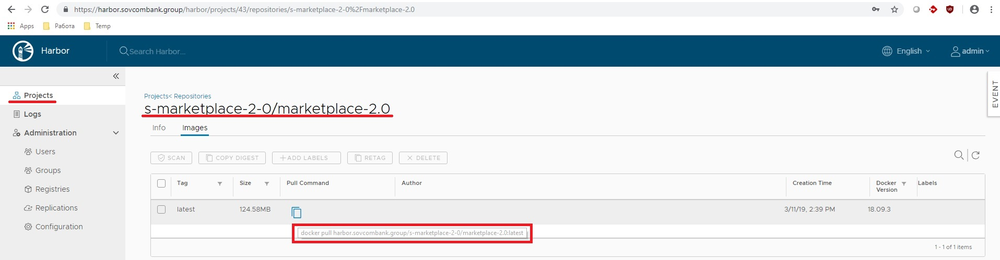

# Описание pipeline проекта

## Принятые соглашения и предварительная подготовка

- При выполнении pipeline текущего проекта можно установить триггер на выполнения конвейера другого проекта (или нескольких). Для этого создается служебная учетная запись Gitlab с ограниченными правами (External User) и назначается с ролью Developer (или выше) на всю группу проектов. Токен учетной записи сохраняется в переменной CI/CD группы `$SA_TOKEN`. Проект (или список проектов) установки триггера определяется переменной `$HOOK_PRJS` в файле *.ci_env*.  
`Если pipeline проекта был запущен по триггеру, то в данном pipeline другие триггеры установлены не будут, назависимо от значения переменной $HOOK_PRJS. Сделано для исключения зацикливания выполнения pipeline проектов, ссылающихся друг на друга в своих переменных $HOOK_PRJS`  

- Выделено 4 стандартных окружения: dev, test, stage, prod.  
`Изменение названий окружений влечет за собой их полное пересоздание с удалением всех текущих объектов приложения в кластере Kubernetes.`  

- Окружение **dev** разделяется всеми разработчиками проекта, незаввисимо друг от друга. Окружение пересоздается каждый раз при разворачивании приложения.  

- Разработчики сами определяют, какие объекты должны быть созданы в кластере установкой переменных файла *./helm/values.yaml*, в каком окружении (`$ENVRM` в файле *.ci_env*), в каких проектах установить триггеры, ветвь репозитория, относительно которой будут выполняться pipeline по триггерам.  
`Более подробное описание всех переменных приведено в комментариях к ним.`  

- Pipeline выполняется при отправке изменений в некоторые ветви удаленного репозитория. В какие - определяет разработчик, установкой параметра **only** в описании каждой стадии (файл *.gitlab-ci.yml*).  
  
- Для доступа к приложению по http(s) снаружи кластера, необходимо включить установку Ingress при разворачивании приложения (*./helm/values.yaml*). В кластере настроена единая точка входа по http(s), проксирование в необходимое окружения устанавливается доменным именем (dev-kuber.sovcombank.group), в необходимый проект - локейшеном, совпадающим с именем проекта в Gitlab. Например, полный URL к проекту marketplace-2.0 в окружении dev будет выглядеть, так: <https://dev-kuber.sovcombank.group/marketplace-2.0>.  

- Для доступа по другим протоколам снаружи и доступа из кластера к внешним сервисам, необходимые настройки предварительно обсуждаются.  

Переменные должны быть правильно установлены перед выполнением конвейера.  
`От перемиенной $ENVRM зависит не только окружение, но и имя Docker образа, который будет загружен в Registry и использован при разворачивании приложения. Для каждого окружения создается свой образ.`  
`Значение переменной $ENVRM обязательно должно совпадать с каким-то из, перечисленных выше, названий окружения! Допустимые значения указаны в файле .ci_env`  
Предлагается такой подход - забираем файлы CI/CD (ветвь ci-cd) в нужную ветвь своего локального репозитория, правим переменные и, после этого, отправляем изменения в удаленный репозиторий. Для каждой ветви, понятно, делается один раз.  

## Описание стадий pipeline

1. ***test.*** Стадия сборки и тестирования приложения, запускается в контейнере maven, версия определяется переменной, результат сборки приложения сохраняется как артефакт для использования на следующей стадии. Время жизни артефакта – 2 часа.  
`Условие выполнения – push в любую ветку, установленную в описании стадии.`  

2. ***build.*** Стадия сборки docker образа приложения. Образ сохраняется в локальном приватном Registry (используем Harbor) - <https://harbor.sovcombank.group>, имя образа приводится к шаблону: **harbor.sovcombank.group/идентификатор_проекта/имя_проекта_Gitlab**. Идентификатор проекта - полный путь к проекту в Gitlab (группа/подгруппа/проект), сокращенный до первых символов названия группы и подгрупы, разделенных дефисом, с полным именем проекта. Идентификатор преобразуется к буквенно-цифровым символам в нижнем регистре, все прочие символы заменяются дефисом. Например:
    - URL проекта - <https://gitlab.sovcombank.group/sovcombank-java-group/marketplace-2.0>  
    - Имя образа - harbor.sovcombank.group/s-marketplace-2-0/marketplace-2.0  

    `Условие выполнения – push в любую ветку, установленную в описании стадии.`

*По ссылке https://harbor.sovcombank.group доступен web UI, где можно просматривать/удалять загруженные образы, получить ссылку на загрузку (показано на скриншоте). Для получения персонального доступа (доменная аутентификация) пока достаточно письма мне. В CI/CD pipeline используется служебная доменная учетная запись.*  

  

3. ***review.*** Стадия разворачивания и удаления объектов приложения в кластере Kubernetes.  
`Условие выполнения деплоя – push в любую ветку, установленную в описании стадии.`  
`Условие выполнения удаления – запускается вручную.`  

4. ***hook.*** Стадия установки триггера выполнения pipeline связанного проекта.  
`Условие выполнения – push в любую ветку, установленную в описании стадии.`  

Пример переноса файлов описания CI/CD в нужную ветвь репозитория:  

```
git fetch origin ci-cd
git checkout ci-cd
git checkout <dev_branch>
git checkout ci-cd .gitlab-ci.yml Dockerfile README_CI.md pull_image_url.jpg .ci_env helm
git add .
git commit -m "Merged ci-cd files"
git push
```

## Переменные окружения CI/CD проекта
  - `CI_REGISTRY_USER` - имя администратора проекта Harbor.  
  - `CI_REGISTRY_PASSWORD` - пароль администратора проекта Harbor.  
  - `K8S_URL` - URL кластера Kubernetes (<https://urdc-k8s-clb.sovcombank.group:16443>).  
  - `K8S_TOKEN` - токен учетной записи Kubernetes с ролью *edit* в соответствующих пространствах имен.  
  - `K8S_CLUSTER` - имя кластера Kubernetes.  
  - `K8S_NAMESPACE_BASE` - базовый namespace, равный идентификатору проекта разработки.  
  - `MAVEN_VERSION` - версия образа maven в Docker Hub (3.6-jdk-8-alpine).  
  - `SA_TOKEN` - токен служебной учетной записи Gitlab, используется при создании триггеров в связанных проектах.  