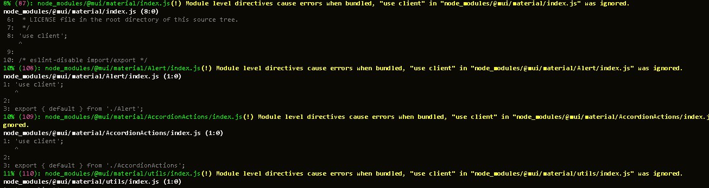

# Rollup

### WHY ROLLUP?

+ В среднем сборка на rollup быстрее
+ Из коробки есть tree shaking
+ На мой взгляд, гибче в настройке

[Статья](https://www.educba.com/rollup-vs-webpack/) где приводятся +/- Rollup & Webpack

### WHY NOT ROLLUP?

+ Мало туториалов
+ Мало снипетов и готовых "правильных" решений распростроненных задач
+ Долгая и не всегда прозрачная настройка

## Краткий курс счастливой настройки Rollup

* Code splitting

```
input: ["./src/index.ts", ...getFiles("./src/components", extensions, ignoreExtensions)],
```
В ***input*** передаются точки входа сборщика (если не использовать code splitting можно просто передать корневой index.ts файл из src)  
Ф-я ***getFiles*** получает папку входа, расширения и игнорируемые файлы - возвращат список путей к файлам входа для code splitting

```
 output: {
      dir: "lib", // назвние папки для билда
      format: "esm", // формат выходных файлов (есть еще cjs, но у меня не получилось настроить сборку для обоих)
      // code-splitting
      preserveModules: true, // разбивает код на файлы сохраняя файловую структуру
      preserveModulesRoot: "src", // указание корневой директории для code splitting
      entryFileNames: (chunkInfo) => {
        if (chunkInfo.name.includes("node_modules")) {
          return `${chunkInfo.name.replace("node_modules", "external")}.js`;
        }

        return "[name].js";
      },
    },
```

По умолчанию при использовании **preserveModules** во время билда создается папка *node_modules* для зависимостей компонентов, однако при публикации эта папка **игнорируется** и из-за этого в web приложение не импортируются необходимые компоненты для библиотеки - приложение падает
```
 entryFileNames: (chunkInfo) => {
        if (chunkInfo.name.includes("node_modules")) {
          return `${chunkInfo.name.replace("node_modules", "external")}.js`;
        }

        return "[name].js";
      },
```

Для указания внешних зависимостей, которые будт подтяигиваться из импортирующего проекта исполбзуется поле **external**  
```external: ["react", "react-dom"]```

При билде вылезает куча предупреждений на использование директивы **'use client'**. Для того чтобы упростить чтение логов во время билда я убрал их с помощью:
```
onwarn(warning, warn) {
      // for hide 'use client' warning
      if (warning.code === "MODULE_LEVEL_DIRECTIVE") {
        return;
      }
      warn(warning);
    }
```


### Самое интересное - плагины

В общем случае, используемые плагины можно разделить на плагины для упрощения разработки/логов и плагины для сборки

##### Плагины для упрощения разработки: 

+ progress ([rollup-plugin-progress](https://www.npmjs.com/package/rollup-plugin-progress))  
    показывает текущий статус сборки

+ sizes ([rollup-plugin-sizes](https://www.npmjs.com/package/rollup-plugin-sizes))  
    показывает размеры собранных файлов

+ visualizer ([rollup-plugin-visualizer](https://www.npmjs.com/package/rollup-plugin-visualizer))  
    генерирует html файл с наглядной демострацией размеров бандлов

##### Плагины для сборки:

+ peerDepsExternal ([rollup-plugin-peer-deps-external](https://www.npmjs.com/package/rollup-plugin-peer-deps-external))  
    подтягивает из package.json и удаляет из сборки peerDependencies - позволяет обойтись без ```external: ["react", "react-dom"]```

+ alias ([@rollup/plugin-alias](https://www.npmjs.com/package/@rollup/plugin-alias))  
    позволяет использовать алиасы (в данном случае @src/)

+ json ([@rollup/plugin-json](https://www.npmjs.com/package/@rollup/plugin-json))  
    позволяет импортировать json файлы

+ resolve ([@rollup/plugin-node-resolve](https://www.npmjs.com/package/@rollup/plugin-node-resolve))  
    подгружает необхрдимые файлы из node_modules (Не совсем понимаю зачем этот плагин)

+ commonjs ([@rollup/plugin-commonjs](https://www.npmjs.com/package/@rollup/plugin-commonjs))  
    конвертирует cjs файлы в ES6 

+ babel ([@rollup/plugin-babel](https://www.npmjs.com/package/@rollup/plugin-babel))  
    для интеграции babel (а он нам точно нужен?)

+ typescript ([@rollup/plugin-typescript](https://www.npmjs.com/package/@rollup/plugin-typescript))  
    для интеграции с typescript

+ postcss ([rollup-plugin-postcss](https://github.com/egoist/rollup-plugin-postcss))  
    для стилей и интеграции sass/scss

+ url ([@rollup/plugin-url](https://www.npmjs.com/package/@rollup/plugin-url))  
    для импорта файлов в формате ES Modules

+ svgr ([@svgr/rollup](https://react-svgr.com/docs/rollup/))  
    для импорта svg картинок

**P.s Инструкцию о том в каком порядке подключать плагины - не нашел(подключал секретным методом тыка)**

## Что дальше? (todo)

- [ ] Решить проблему с путями (ищет файлы в @ecom/src, а должен @ecom/ui/src - возможно из-за source map) 
- [ ] Решить проблему с импортом картинок (в конечном прилодении не отображаются картинки)
- [ ] Сделать так, чтобы не приходилось импортирвать стили для компонентов (чтобы простого import Component from "@ecom/ui/Component" было достаточно)
- [ ] Оптимизировать конечный бандл (из-за code-splitting создает "лишние" бандлы)

P.s. Если задолбаешься - переходи на webpack
