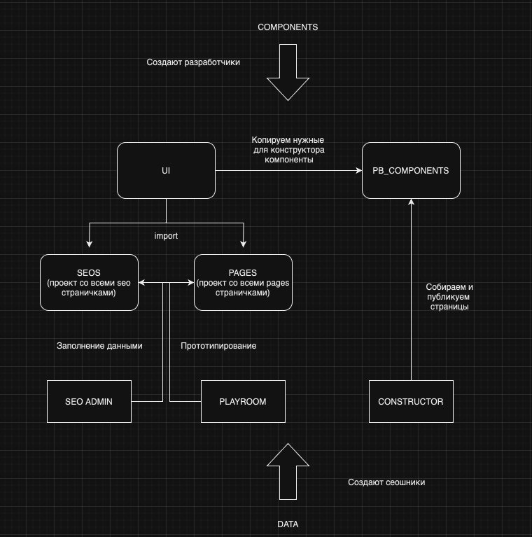

# T0DO://

### Что дальше?

- [ ] Решить проблему с путями (сборщик)
- [ ] Добавить плагин для изображений (сборщик)
- [ ] Насторить до конца скиншотные тесты (попросить помощи у Михаила, если не получиться)
- [ ] Добавить хедер для credit (кредитный доктор)
- [ ] Добавить кнопки
- [ ] Отрефакторить темы
- [ ] Добавить компоненты с credit
- [ ] Потихоньку переносить компоненты с мелких проектов
- [ ] Добавить компоненты в pb_components
- [ ] Вынести страницы pages из всех проектов в один
- [ ] Вынести seo страницы из всех проектов в один
- [ ] Настроить публикацию страниц на нужные URL с созданных SEO и PAGES ПРОЕКТОВ!
- [ ] Разобраться с конструктором
- [ ] Добавить возможность сеошникам собирать страницы pages для A/B тестирования с помощью playroom (в нем собирают) и seo админки

